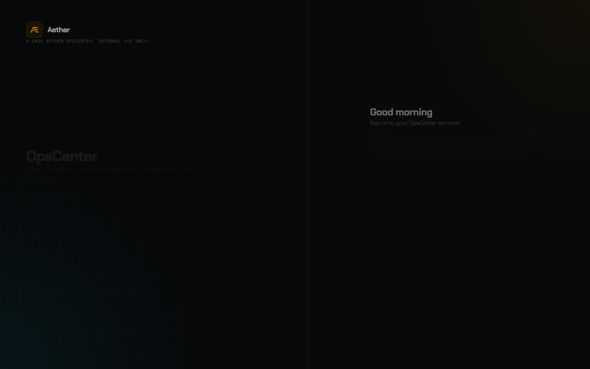
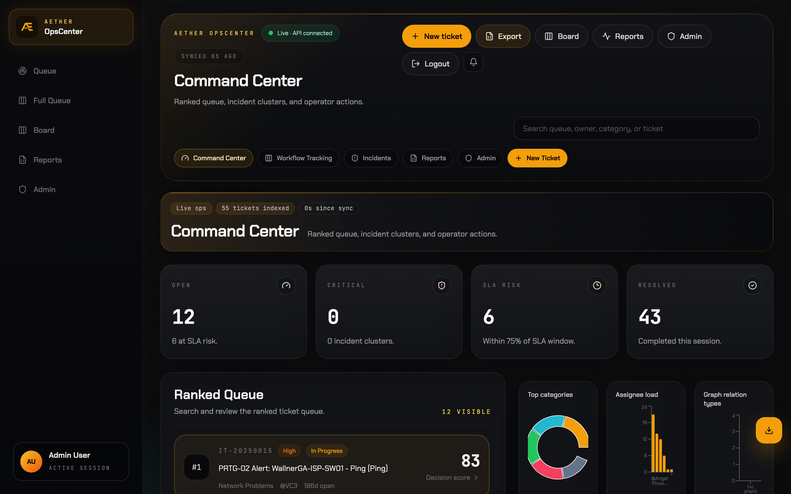
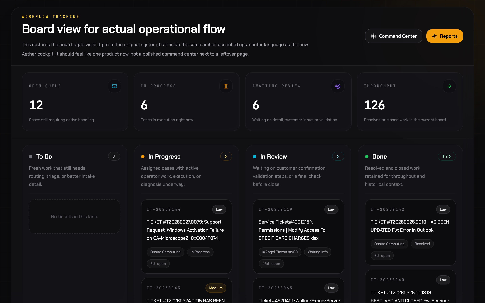
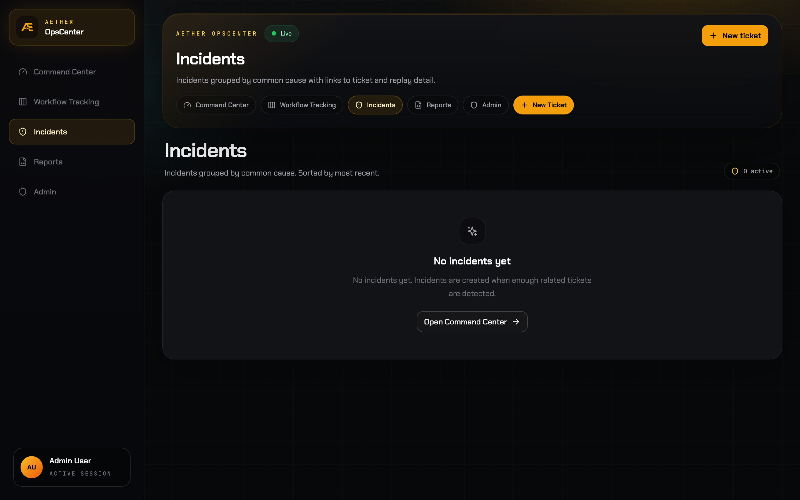
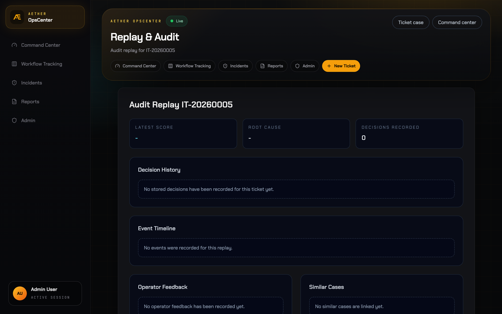
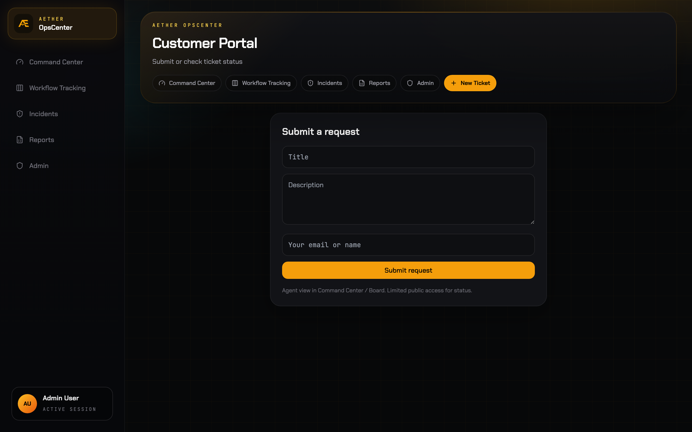
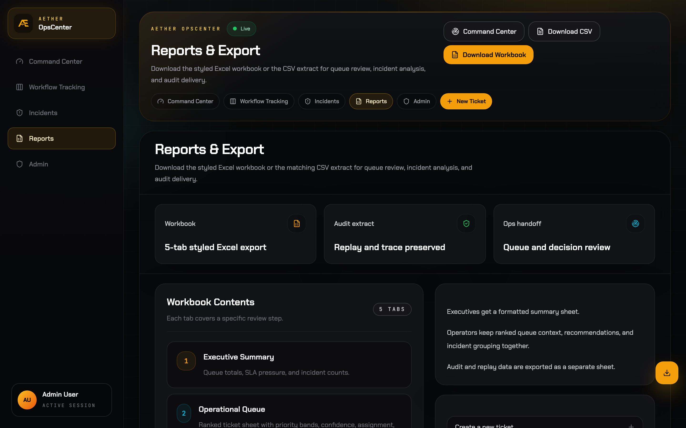
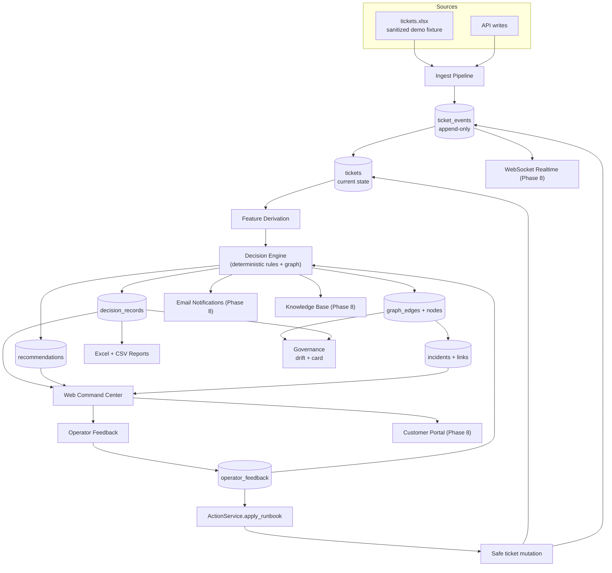

# Aether OpsCenter

**Live incident intelligence, ticket orchestration, and audit-ready reporting for modern support and operations teams.**

Aether OpsCenter turns live service tickets into ranked, explainable actions across a unified command center, workflow board, incident detail views, replay timelines, and styled Excel exports. The current platform is API-backed end to end, uses authenticated access for protected routes, and keeps operators inside one consistent workflow instead of splitting triage, incident review, and reporting across disconnected tools.

## Screenshots

Dense B2B ops UI with deterministic graph + rules intelligence (PageRank centrality, 7 edge types, sigmoid urgency, entropy uncertainty, decision bands, fingerprints, graph-aware incidents, real action runs) and Phase 8 surfaces. Single locked amber accent, mono IDs/scores, hairline data, full UI cycles, mobile grid-cols-1 + short nav.

### Login



### Command Center

Full queue + graph centrality bar, subscores, bands, Snapshot Analytics (drift signals, relation types).



### Workflow Board

Kanban with inline detail drawer (graph features, root cause, priority interval, quick link), tactile press, Escape key.



### Incidents

Graph evidence (edge counts for asset/root_cause/site), shared actors, recommended action from clusters.



### Replay

Decision hash, band, interval, graph degree/weighted_degree, anomaly z-score, action runs from apply/feedback.



### Customer Portal (Phase 8)

Submit (title/desc/site/priority) flows to command/board with intel; status by key.



### Reports

Styled Excel for queue/incidents/audit including current decision fields and graph data.



## Core Capabilities

- **Command Center** — Live ranked queue, KPI overview, trend charts, incident cluster awareness, and ticket inspection in a single operator surface
- **Workflow Board** — Lane-based operational board for active work, review states, and throughput visibility
- **Incident Intelligence** — Automatic clustering of related tickets with linked incident detail pages and exportable incident reporting
- **Ticket Intelligence** — Per-ticket decision context, recommendation stacks, event history, and related-case lookup
- **Replay & Audit** — Event-sourced replay timeline with decision history, operator feedback, and similar-case traceability
- **Styled Reporting** — Backend-generated Excel workbook for executive summaries, queue review, incident review, and audit handoff
- **Authenticated Operations UI** — Login flow, protected routes, logout, persisted notifications, and JWT-backed user validation
- **Phase 8 Competitor Parity** — Full email (outbound + inbound stub), WebSocket realtime, customer portal (submit/status), KB/articles, webhooks, SLA policies, RBAC extensions, dashboard builder scaffolding, theme prefs. See Phase 8 in docs/implementation/phased-roadmap.md.

## Architecture



**Decision intelligence uses only deterministic rules, graph links (7 edge types), drift checks, and recommendation feedback.** No trained ML model, no external LLM.

Example live state (recent run on seeded data):

- Graph nodes: 23
- Graph edges: 458
  - shared requester: 77
  - shared assignee: 253
  - shared site: 5
  - within time window: 123
- Recommendations: 229
- Feedback / runs: 0 / 0
- Drift status: drift
- Similar links: 0
- Drift signals (weekly): priority Δ 50.2714 (502714%), uncertainty Δ 8.5714 (85714%) (deltas common on small/demo sets)

## Tech Stack

| Layer | Technology |
|---|---|
| Frontend Framework | Next.js 16 App Router, React 18, TypeScript |
| UI & Styling | Tailwind CSS, Lucide React, custom glass/ops UI system |
| Frontend Data & Utilities | Axios, date-fns, Zustand, TanStack Table, Recharts |
| Backend API | FastAPI, SQLAlchemy 2, Pydantic 2, python-jose, Passlib |
| Database | PostgreSQL on Neon |
| Migrations | Alembic |
| Reporting | openpyxl-based styled Excel workbook generation |
| Data Processing | pandas, openpyxl |
| Auth | JWT access tokens, bcrypt password hashing, legacy SHA-256 migration, local/demo JSON user store |
| Tooling | ESLint, TypeScript, Playwright dependency, Ruff, MyPy, Pytest |
| Infra & Delivery | Docker, Docker Compose, GitHub Actions |

## Quick Start

```bash
# From repo root
cp .env.example .env

# Install backend and frontend dependencies
make deps

# Apply migrations and start each service
make migrate
make api
make web
```

The API runs on port 8000. The web app runs on the port selected by Next.js, usually 3000.

### Demo And Private Ticket Data

The repo includes a sanitized demo workbook at `tickets.xlsx` with fake tickets,
people, sites, and assets. The Excel import path expects that filename at the
repo root and the `IT Service Tickets` sheet, so the public fixture lets a fresh
clone run the demo import path.

Do not overwrite the tracked demo workbook with real workplace data. Keep
private exports under ignored names such as `tickets.private.xlsx` or in
`private-data/`. If the public demo data needs to change, replace it only with
sanitized records.

Deployment URLs are operational details, not public docs. Do not commit the
live Render hostname or other private deployment links; use placeholders such
as `<deployed-host>` in documentation.

### Local Auth Credentials

The shipped `users.json` includes only the safe viewer demo account. Share only
the viewer account for public demos.

- Viewer username: `viewer`
- Viewer password: `viewer123`

If you need a local admin account, run `make seed-auth`. It rewrites
`users.json`, prints a one-time local admin password, and keeps the viewer demo
account. The login page demo badge fills the viewer account only; admin
credentials are for private/local maintenance and must not be published.

### Safe Public Demo Mode

The public demo is designed to be shareable with sanitized data. Set
`DEMO_MODE=true`, `DEMO_PORTAL_SUBMIT_ENABLED=true`, and
`NEXT_PUBLIC_DEMO_MODE=true` for the demo deployment. In this mode:

- Shared credentials should be `viewer` / `viewer123`.
- Viewers can browse the command center, board, incidents, replay, governance,
  assets, and sanitized reports.
- Viewers cannot edit, delete, move, label, comment on, attach files to, or
  apply actions to tickets.
- Viewers cannot manage users, catalog options, SLA policies, webhooks,
  diagnostics, KB articles, automation rules, or recommendation state.
- Portal submissions require a signed-in viewer and are tagged as demo records
  (`source_system=demo_portal`, `custom_fields.demo=true`).
- Do not publish admin credentials or live deployment hostnames in repo docs.
- Production demo deployments must also set `ADMIN_BOOTSTRAP_PASSWORD` and a
  non-default `SECRET_KEY` through private deployment secrets. These values must
  not be committed.

### Security And Regression Guardrails

The repo has automated checks for the past public-demo failure modes:

- Production startup fails when `SECRET_KEY` is still the default,
  `DEBUG=true`, wildcard CORS is configured, or public demo mode is enabled
  without `ADMIN_BOOTSTRAP_PASSWORD`.
- API tests include demo canaries for weak admin passwords and synthetic-only
  demo ticket data.
- API tests include an endpoint sweep (`tests/api/test_endpoint_sweep.py`) that
  introspects registered FastAPI routes and fails on unexpected `500` responses
  for anonymous, viewer, and admin request probes.
- GitHub Actions runs `Secret Scan` with Gitleaks on every push and pull
  request. The only allowlisted plaintext credential is the intentional public
  viewer demo password.
- GitHub Actions runs API lint, MyPy, tests, and coverage on all pushes and pull
  requests. Web lint, typecheck, and production build also run on all pushes and
  pull requests.
- `Live Smoke` can run against a deployed demo using GitHub Actions secrets:
  `RENDER_APP_URL` is required, and `ADMIN_LIVE_PASSWORD` is optional for
  private admin verification. The workflow checks viewer login, rejects
  `admin/admin123`, fails if the ticket list contains non-synthetic titles, and
  runs the Playwright live smoke against the deployed UI.
- Playwright smoke tests live in `apps/web/e2e/` and can run against any already
  running local or deployed stack:

```bash
cd apps/web
PLAYWRIGHT_BASE_URL=http://127.0.0.1:3000 npm run e2e
PLAYWRIGHT_BASE_URL=<deployed-host> npm run e2e:live
```

Install browsers after a fresh checkout or global Playwright upgrade:

```bash
cd apps/web
npx playwright install chromium
```

Dependency audit status: the web app is upgraded to Next.js 16 with a PostCSS
override for the patched 8.5.x line, and `npm audit` should remain at zero known
vulnerabilities.

Optional local hook setup:

```bash
pip install pre-commit
pre-commit install
pre-commit run --all-files
```

### Port Flexibility

If `8000` is already taken on your machine (common on developer machines
with another Python service running), the Makefile targets can be
overridden:

```bash
# API on a free port
API_PORT=8002 make api

# Web dev with that port wired through
API_INTERNAL_URL=http://127.0.0.1:8002 \
NEXT_PUBLIC_API_URL=http://127.0.0.1:8002/api \
  make web
```

The mobile-screenshot / verification scripts in `scripts/` also accept
`API_BASE_URL` and `BASE_URL` so they can be re-pointed at a non-default
port without code changes.

## Development Commands

| Command | Purpose |
|---|---|
| `make deps` | Install Python dev package and web dependencies |
| `make dev` / `make api` | Run the FastAPI app with reload on port 8000 (or `API_PORT=N` to override) |
| `make web` | Run the Next.js dev server from `apps/web` |
| `make test` | Run the Python test suite |
| `make lint` | Run Python and web lint commands |
| `make lint-py` | Run Ruff over backend, domain, infrastructure, pipelines, scripts, and tests |
| `make lint-web` | Run `npm run lint` in `apps/web` |
| `make typecheck` | Run MyPy over Python packages and tests |
| `make migrate` | Apply Alembic migrations and initialize DB metadata |
| `make rollback` | Downgrade one Alembic migration |
| `make build-docker` | Build Docker images with `docker/docker-compose.yml` |
| `make run-docker` | Start the Docker stack with `docker/docker-compose.yml` |
| `make seed-auth` | Rewrite `users.json` with a generated local admin password and the documented viewer demo account |
| `cd apps/web && npm run typecheck` | Run TypeScript typecheck |
| `cd apps/web && npm run build` | Build the production Next.js app |
 
## Auth Notes

- Passwords are hashed with bcrypt through Passlib. Existing 64-character SHA-256 hashes are treated as legacy values and migrated to bcrypt after a successful login.
- JWT access tokens expire after 8 hours.
- Logout clears the browser session. Tokens are not server-revoked unless a future server-side session denylist is added.
- Login throttling supports two backends: in-memory (default, suitable for single-process demo) and Redis (set `RATE_LIMIT_BACKEND=redis` and `REDIS_URL`). The rate limiter falls back to in-memory if Redis is unreachable.
- User records currently live in `users.json` or the configured `USERS_FILE`. Moving users into PostgreSQL is a known follow-up.
- Production startup rejects the default `SECRET_KEY` and rejects wildcard CORS origins when credentialed CORS is enabled.

## Legacy App Preserved

The original working Flask system is still intact:

- `app.py`
- `etl_pipeline.py`
- `templates/`
- `requirements.txt`
- `docker-compose.yml`

The new Aether layer enhances the same ticketing dataset and Neon deployment path instead of deleting the legacy app.

## Project Structure

```
apps/
  api/          # FastAPI backend (routes, services, schemas)
  web/          # Next.js 16 frontend (command center, case views)
domain/
  enums.py      # All operational enums
  policies.py    # Scoring weights and thresholds
pipelines/
  ingest/       # Excel loader, delta detector, normalizer
  features/     # Feature derivation per ticket
  decisions/    # Priority scoring, root cause rules, recommendations
  retrieval/    # Similar cases, duplicate detection, clustering
  reports/      # 5-tab Excel workbook generator
infrastructure/
  db/           # SQLAlchemy models, session, migrations
  messaging/    # WebSocket hub, event bus
  search/       # Embedding provider, vector store
  storage/      # Report store, object store
  logging/      # Audit logger, metrics logger
docs/
  architecture/ # Mermaid system diagrams
  product/      # Operator workflows, screen maps
  implementation/ # Migration plan, api contracts, roadmap
```

## Decision Score Formula

```
priority_score =
  (0.22 × severity) +
  (0.18 × urgency) +
  (0.20 × business_impact) +
  (0.14 × sla_risk) +
  (0.10 × recurrence) +
  (0.08 × dependency_criticality) +
  (0.08 × actionability) −
  (0.10 × uncertainty_penalty)
```

## API Endpoints

| Method | Path | Description |
|---|---|---|
| GET | /api/tickets | List tickets with filters, ranking |
| GET | /api/tickets/{ticket_id} | Ticket detail with decision, recommendations, events |
| GET | /api/tickets/{ticket_id}/events | Ticket event timeline |
| GET | /api/incidents | Clustered incidents |
| GET | /api/incidents/{incident_id} | Incident detail with linked tickets |
| GET | /api/decisions/{ticket_id} | Get existing decision for ticket |
| POST | /api/decisions/recompute/{ticket_id} | Recompute decision |
| POST | /api/recommendations/{id}/accept | Accept recommendation |
| POST | /api/recommendations/{id}/reject | Reject recommendation |
| POST | /api/recommendations/{id}/override | Override with note |
| GET | /api/reports/excel | Generate 5-tab styled workbook |
| GET | /api/replay/{ticket_id} | Audit timeline and snapshots |
| GET | /api/metrics | Operational metrics dashboard data |
| GET | /api/assets | Asset inventory and relationships |
| GET | /api/events | Event stream query |
| POST | /api/auth/login | Authenticate and get session |

## Root Cause Classes

access_identity | email_messaging | shared_mailbox_forwarding | printer_scanner |
file_share_permissions | erp_application | workstation_endpoint | network_connectivity |
infrastructure_service | security_spam_block | production_system_integration | unknown

## License

MIT
