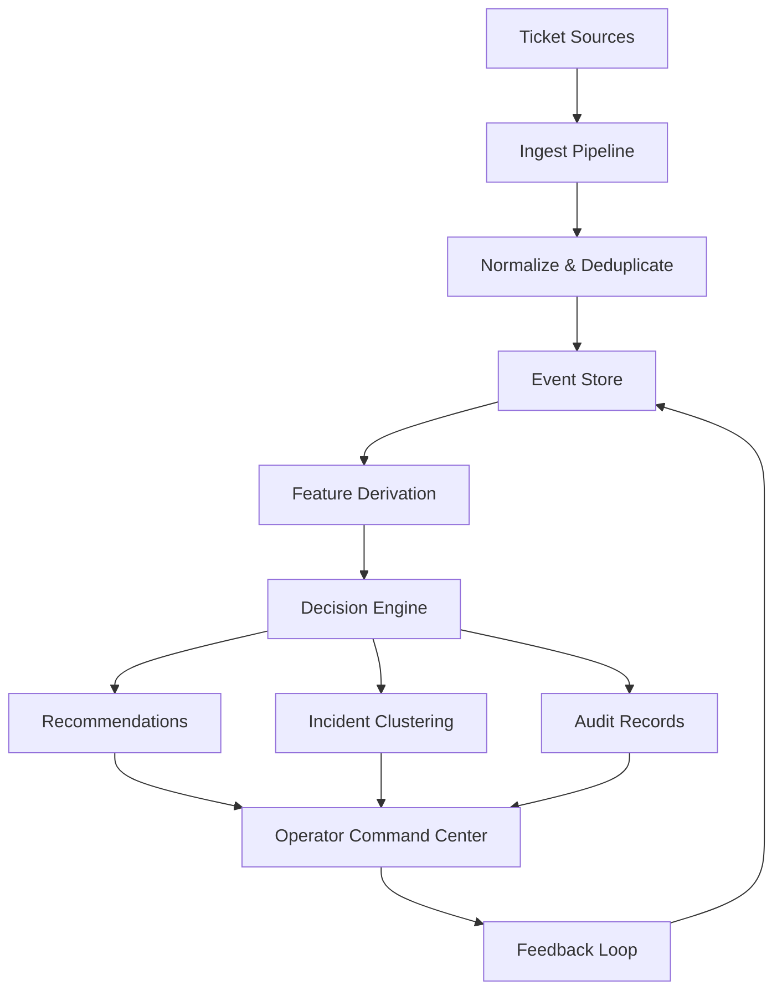

# Aether OpsCenter

**Live incident intelligence, ticket orchestration, and audit-ready reporting for modern support and operations teams.**

Aether OpsCenter turns live service tickets into ranked, explainable actions across a unified command center, workflow board, incident detail views, replay timelines, and styled Excel exports. The current platform is API-backed end to end, uses authenticated access for protected routes, and keeps operators inside one consistent workflow instead of splitting triage, incident review, and reporting across disconnected tools.

## Screenshots

### Login


### Command Center


### Workflow Board


### Reports


## Core Capabilities

- **Command Center** — Live ranked queue, KPI overview, trend charts, incident cluster awareness, and ticket inspection in a single operator surface
- **Workflow Board** — Lane-based operational board for active work, review states, and throughput visibility
- **Incident Intelligence** — Automatic clustering of related tickets with linked incident detail pages and exportable incident reporting
- **Ticket Intelligence** — Per-ticket decision context, recommendation stacks, event history, and related-case lookup
- **Replay & Audit** — Event-sourced replay timeline with decision history, operator feedback, and similar-case traceability
- **Styled Reporting** — Backend-generated Excel workbook for executive summaries, queue review, incident review, and audit handoff
- **Authenticated Operations UI** — Login flow, protected routes, logout, persisted notifications, and JWT-backed user validation

## Architecture



## Tech Stack

| Layer | Technology |
|---|---|
| Frontend Framework | Next.js 14 App Router, React 18, TypeScript |
| UI & Styling | Tailwind CSS, Lucide React, custom glass/ops UI system |
| Frontend Data & Utilities | Axios, date-fns, Zustand, TanStack Table, Recharts |
| Backend API | FastAPI, SQLAlchemy 2, Pydantic 2, python-jose, Passlib |
| Database | PostgreSQL on Neon |
| Migrations | Alembic |
| Reporting | openpyxl-based styled Excel workbook generation |
| Data Processing | pandas, openpyxl |
| Auth | JWT access tokens, bcrypt password hashing, legacy SHA-256 migration, local/demo JSON user store |
| Tooling | ESLint, TypeScript, Playwright dependency, Ruff, MyPy, Pytest |
| Infra & Delivery | Docker, Docker Compose, GitHub Actions |

## Quick Start

```bash
# From repo root
cp .env.example .env

# Install backend and frontend dependencies
make deps

# Apply migrations and start each service
make migrate
make api
make web
```

The API runs on port 8000. The web app runs on the port selected by Next.js, usually 3000.

## Development Commands

| Command | Purpose |
|---|---|
| `make deps` | Install Python dev package and web dependencies |
| `make dev` / `make api` | Run the FastAPI app with reload on port 8000 |
| `make web` | Run the Next.js dev server from `apps/web` |
| `make test` | Run the Python test suite |
| `make lint` | Run Python and web lint commands |
| `make lint-py` | Run Ruff over backend, domain, infrastructure, pipelines, scripts, and tests |
| `make lint-web` | Run `npm run lint` in `apps/web` |
| `make typecheck` | Run MyPy over Python packages and tests |
| `make migrate` | Apply Alembic migrations and initialize DB metadata |
| `make rollback` | Downgrade one Alembic migration |
| `make build-docker` | Build Docker images with `docker/docker-compose.yml` |
| `make run-docker` | Start the Docker stack with `docker/docker-compose.yml` |
| `cd apps/web && npm run typecheck` | Run TypeScript typecheck |
| `cd apps/web && npm run build` | Build the production Next.js app |
 
## Auth Notes

- Passwords are hashed with bcrypt through Passlib. Existing 64-character SHA-256 hashes are treated as legacy values and migrated to bcrypt after a successful login.
- JWT access tokens expire after 8 hours.
- Logout clears the browser session. Tokens are not server-revoked unless a future server-side session denylist is added.
- Login throttling is in-memory and keyed by username plus client IP. This is suitable for the current local/demo deployment shape; multi-process production deployments should move throttling state to Redis or another shared store.
- User records currently live in `users.json` or the configured `USERS_FILE`. Moving users into PostgreSQL is a known follow-up.
- Production startup rejects the default `SECRET_KEY` and rejects wildcard CORS origins when credentialed CORS is enabled.

## Legacy App Preserved

The original working Flask system is still intact:

- `app.py`
- `etl_pipeline.py`
- `templates/`
- `requirements.txt`
- `docker-compose.yml`

The new Aether layer enhances the same ticketing dataset and Neon deployment path instead of deleting the legacy app.

## Project Structure

```
apps/
  api/          # FastAPI backend (routes, services, schemas)
  web/          # Next.js 14 frontend (command center, case views)
domain/
  enums.py      # All operational enums
  policies.py    # Scoring weights and thresholds
pipelines/
  ingest/       # Excel loader, delta detector, normalizer
  features/     # Feature derivation per ticket
  decisions/    # Priority scoring, root cause rules, recommendations
  retrieval/    # Similar cases, duplicate detection, clustering
  reports/      # 5-tab Excel workbook generator
infrastructure/
  db/           # SQLAlchemy models, session, migrations
  messaging/    # WebSocket hub, event bus
  search/       # Embedding provider, vector store
  storage/      # Report store, object store
  logging/      # Audit logger, metrics logger
docs/
  architecture/ # Mermaid system diagrams
  product/      # Operator workflows, screen maps
  implementation/ # Migration plan, api contracts, roadmap
```

## Decision Score Formula

```
priority_score =
  (0.22 × severity) +
  (0.18 × urgency) +
  (0.20 × business_impact) +
  (0.14 × sla_risk) +
  (0.10 × recurrence) +
  (0.08 × dependency_criticality) +
  (0.08 × actionability) −
  (0.10 × uncertainty_penalty)
```

## API Endpoints

| Method | Path | Description |
|---|---|---|
| GET | /api/tickets | List tickets with filters, ranking |
| GET | /api/tickets/{ticket_id} | Ticket detail with decision, recommendations, events |
| GET | /api/tickets/{ticket_id}/events | Ticket event timeline |
| GET | /api/incidents | Clustered incidents |
| GET | /api/incidents/{incident_id} | Incident detail with linked tickets |
| GET | /api/decisions/{ticket_id} | Get existing decision for ticket |
| POST | /api/decisions/recompute/{ticket_id} | Recompute decision |
| POST | /api/recommendations/{id}/accept | Accept recommendation |
| POST | /api/recommendations/{id}/reject | Reject recommendation |
| POST | /api/recommendations/{id}/override | Override with note |
| GET | /api/reports/excel | Generate 5-tab styled workbook |
| GET | /api/replay/{ticket_id} | Audit timeline and snapshots |
| GET | /api/metrics | Operational metrics dashboard data |
| GET | /api/assets | Asset inventory and relationships |
| GET | /api/events | Event stream query |
| POST | /api/auth/login | Authenticate and get session |

## Root Cause Classes

access_identity | email_messaging | shared_mailbox_forwarding | printer_scanner |
file_share_permissions | erp_application | workstation_endpoint | network_connectivity |
infrastructure_service | security_spam_block | production_system_integration | unknown

## License

MIT
