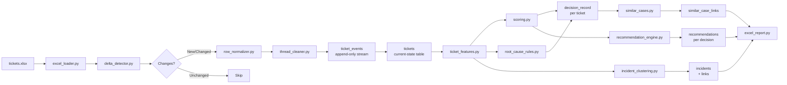

# Data Flow

## Ingest Pipeline

## Delta Detection

1. Read source rows with last-modified hash
2. Compare against stored hash in DB
3. Only process rows where hash changed
4. On new row → emit `ticket_created` event
5. On changed row → emit appropriate status/priority/description event

## Feature Derivation

Each ticket is processed through:
1. **Text cleaning** — remove email threading artifacts, normalize whitespace
2. **Keyword extraction** — TF-IDF top terms per title + description
3. **SLA computation** — elapsed time vs category target
4. **Recurrence lookup** — count same asset/category/site in last 90 days
5. **Business impact** — site weight + asset criticality lookup
