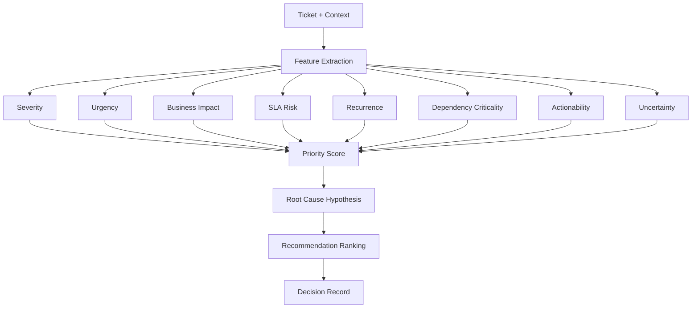
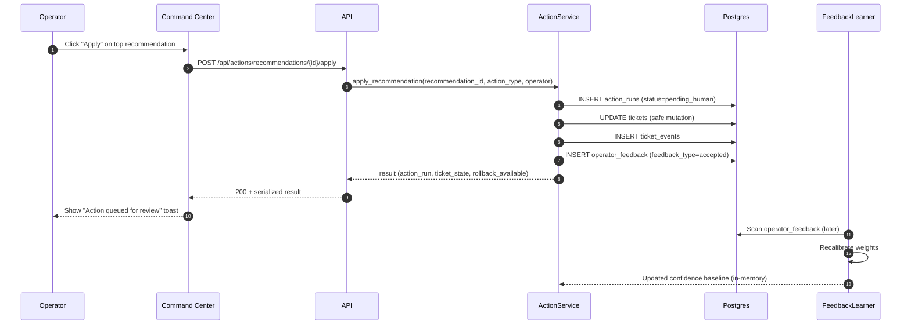

# Decision Engine

## Overview

The decision engine transforms a ticket's features into a priority score, a root cause hypothesis, and ranked action recommendations.



## Priority Score Formula

```
priority_score =
  (0.22 × severity_score) +
  (0.18 × urgency_score) +
  (0.20 × business_impact_score) +
  (0.14 × sla_risk_score) +
  (0.10 × recurrence_score) +
  (0.08 × dependency_criticality_score) +
  (0.08 × actionability_score) −
  (0.10 × uncertainty_penalty)
```

All sub-scores normalized to **0..100**.

## Sub-Score Definitions

### Severity Score (0–100)
Maps raw priority + keyword detection:
- account unlock → 15–30
- printer/scanner → 20–40
- email forwarding/shared mailbox → 35–55
- ERP/Epicor issue → 60–85
- network/infra outage → 75–100

### Urgency Score (0–100)
- age_pressure: linearly increasing with ticket age
- burstiness: rapid comment/follow-up spike signal
- blocked_user_signal: workflow-blocking language
- time_window_modifier: after-hours tickets get boost

### Business Impact Score (0–100)
- site_weight: production site > back-office site
- asset_criticality: linked asset's criticality rating
- user_scope: number of affected users
- cluster_amplification: related tickets amplify impact

### SLA Risk Score (0–100)
```
sla_risk_score = min(100, 100 × (elapsed_hours / sla_target_hours) × backlog_modifier)
```

### Recurrence Score (0–100)
Same asset/category/site pattern frequency in prior 90 days.

### Dependency Criticality Score (0–100)
Keyword-based scoring based on ticket content:
- ERP/server/production/network/VPN keywords → 80
- Email/printer/account/access keywords → 45
- Default for other tickets → 25

### Actionability Score (0–100)
- presence of diagnostic info → +25
- known runbook exists
- similar resolved cases available → +25 max
- category clarity → +20
- base score → 30

### Uncertainty Penalty (0–50)
- incomplete text → +10
- no asset/site match → +15
- low similar-case support → +10
- category ambiguity → +10
- conflicting rules → +5

## Root Cause Classes

| Class | Keywords |
|---|---|
| access_identity | unlock, access, permissions, NTFS, credential |
| email_messaging | outlook, email, inbox, microsoft 365, exchange |
| shared_mailbox_forwarding | shared mailbox, delegate, forwarding |
| printer_scanner | printer, print, scanner, copier |
| file_share_permissions | share, permissions, NTFS, file access |
| erp_application | Epicor, SAP, Oracle, ERP, MRP |
| workstation_endpoint | laptop, desktop, workstation, PC |
| network_connectivity | VPN, network, internet, connectivity, WiFi |
| infrastructure_service | server, datacenter, DNS, DHCP, domain |
| security_spam_block | spam, phishing, blocked, security alert |
| production_system_integration | PLC, SCADA, MES, integration, API |
| unknown | fallback when no class matches |

## Recommendation Contract

Each decision yields 3–5 ranked recommendations:

```json
{
  "ticket_id": "IT-20250001",
  "priority_score": 81.4,
  "root_cause_hypothesis": "shared_mailbox_forwarding",
  "recommendations": [
    {
      "rank": 1,
      "action_type": "apply_runbook",
      "action_label": "Apply shared mailbox forwarding migration runbook",
      "risk_level": "low",
      "confidence": 0.88,
      "expected_benefit": "Reduce reassignment and resolve within 2h",
      "rationale": "Pattern matches 11 resolved prior cases in same category"
    }
  ]
}
```

## Apply → Feedback Loop


