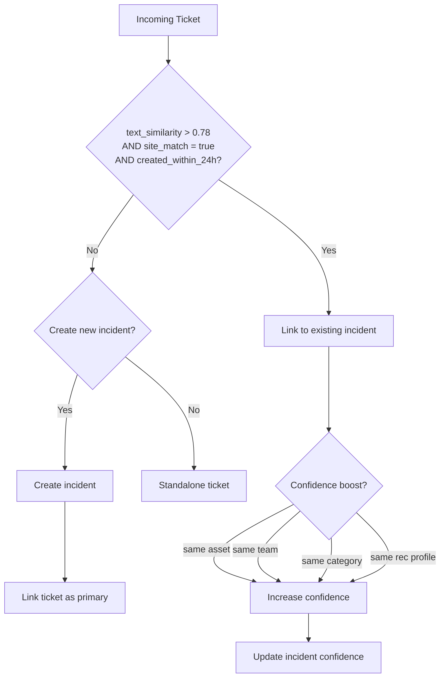
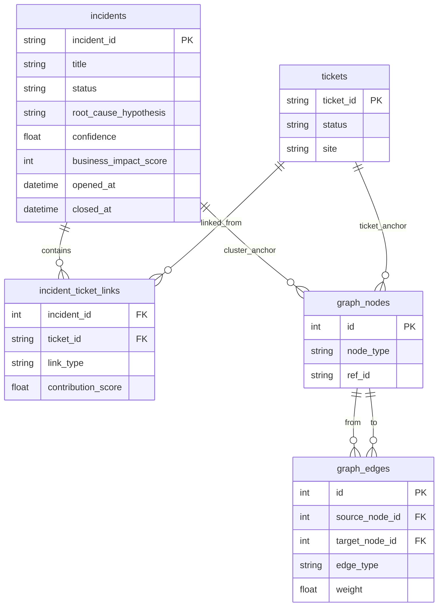

# Incident Clustering

## Overview

Incident clustering groups related tickets into a higher-order "incident" entity, enabling coordinated handling and common-cause analysis.

## Clustering Dimensions

Tickets are candidate clusters when they share:
- Text similarity (title + description keywords)
- Same or related asset
- Same site/location
- Same root cause class
- Time window (created within 24 hours)

## First-Pass Clustering Rule



## Threshold Constants

| Parameter | Value |
|---|---|
| text_similarity_threshold | 0.78 |
| time_window_hours | 24 |
| min_confidence_to_link | 0.60 |
| min_confidence_to_create | 0.75 |

## Link Types

| Type | Description |
|---|---|
| primary | Core ticket defining the incident |
| related | Related but not core |
| duplicate | Likely same root cause |
| inferred | System-suggested link |

## Confidence Scoring

```
cluster_confidence = base_similarity
  + (same_asset × 0.10)
  + (same_team × 0.08)
  + (same_category × 0.07)
  + (same_root_cause × 0.10)
  + (time_proximity_bonus × 0.05)
```

## Incident Lifecycle

1. **Created** — first ticket triggers cluster creation
2. **Updated** — new tickets linked as incident grows
3. **Root cause identified** — hypothesis set by operator or rules
4. **Resolved** — coordinated resolution applied
5. **Closed** — incident archived with lessons learned

## Incident + Graph Data Model


