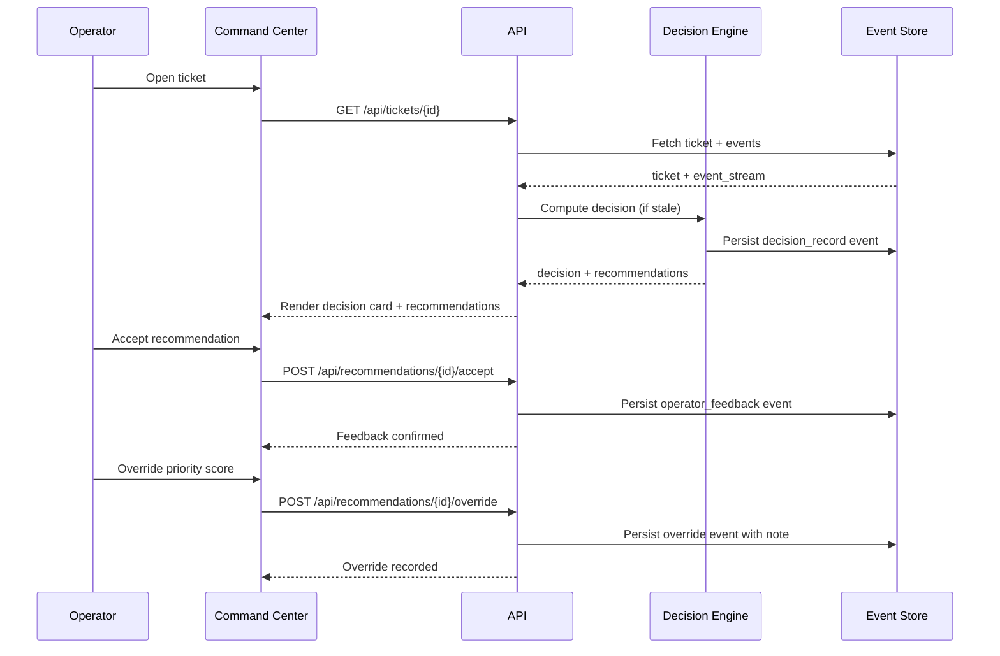

# Replay and Audit Flow

## Overview

Every decision, recommendation, and operator action is captured as an immutable event, enabling full replay and point-in-time audit.

## Event Flow



## Event Types

| Event | Actor Type | Payload |
|---|---|---|
| ticket_created | import/system | full ticket snapshot |
| status_changed | operator | old_status, new_status |
| assignment_changed | operator | old_assignee, new_assignee |
| comment_added | operator/system | comment_text, author |
| priority_changed | operator/system | old_priority, new_priority |
| description_updated | operator | old_description, new_description |
| decision_generated | automation | decision_record_id, scores |
| recommendation_accepted | operator | recommendation_id, feedback_note |
| recommendation_rejected | operator | recommendation_id, reason |
| recommendation_overridden | operator | original_score, override_note |
| incident_linked | automation | incident_id, link_type |
| incident_created | automation/operator | incident_key, hypothesis |

## Point-in-Time Replay

To reconstruct ticket state at time T:
1. Query all `ticket_events` where `event_ts ≤ T` for the ticket
2. Replay events in chronological order
3. Apply each event's payload to reconstruct the state

## Audit Record Model

```python
class AuditRecord:
    entity_type: str          # "ticket", "incident", "decision_record"
    entity_id: str
    snapshot_ts: datetime
    snapshot_json: dict        # full state at snapshot_ts
    version_tag: str          # e.g., "v1.0", "rule-set-2024-Q1"
    reason: str               # "scheduled_snapshot", "operator_request", "override"
```
