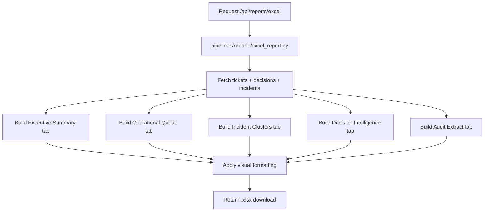

# Reporting Architecture

## 5-Tab Excel Workbook

| Tab | Contents |
|---|---|
| Executive Summary | KPIs, charts, top risks |
| Operational Queue | Full ticket table, styled, filterable |
| Incident Clusters | Cluster summary with linked tickets |
| Decision Intelligence | Score breakdowns, root cause, recommendations |
| Audit Extract | Event timeline, feedback status, execution outcomes |

## Report Generation Flow

## Formatting Standards

- **Header row**: dark fill (#1a1a1a), white bold Calibri 11pt
- **Frozen row**: row 1 always frozen
- **Auto filters**: on all data tables
- **Alternating rows**: subtle gray banding
- **Risk colors**:
  - Critical/High risk → red (#fecaca)
  - At risk → amber (#fef3c7)
  - Healthy/resolved → green (#dcfce7)
- **Charts**: embedded in Executive Summary (status pie, priority bar, SLA risk histogram)
