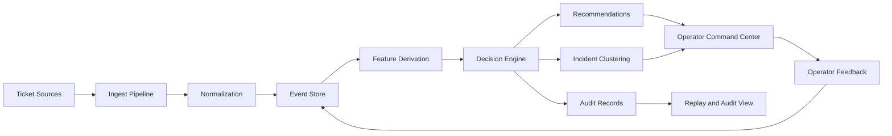
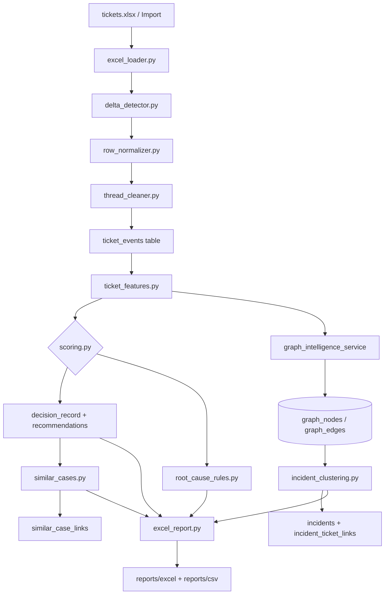
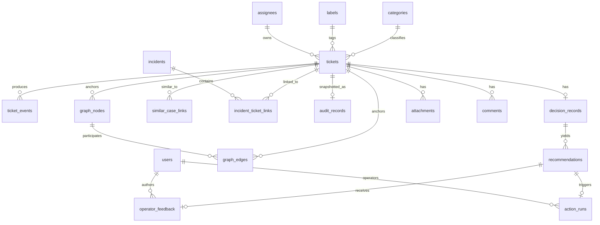
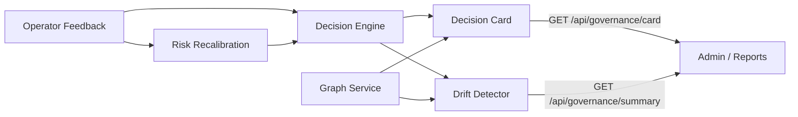

# System Overview

## Context

Aether ingests ticket data from Excel/import sources, transforms it through an event-sourced pipeline, produces ranked decisions and recommendations, and presents an operator command center for action.

## Core Principles

1. **Event sourcing first** — every ticket change produces an immutable event
2. **Decision quality over dashboard fluff** — every feature must improve decision quality, speed, or trust
3. **Explainability by default** — every score and recommendation has a human-readable rationale
4. **Operator in the loop** — human feedback updates weights and improves future decisions

## Data Flow

## Database Architecture

## Governance & Feedback Loops

## Key Design Decisions

- **PostgreSQL on Neon** — managed Postgres, connection pooling, branch-based dev
- **Delta detection over full reload** — last-modified hash comparison avoids reprocessing unchanged rows
- **Rules-first root cause** — keyword matching before ML embedding; faster, more explainable
- **BM25 for similarity** — simpler than embeddings, good enough recall for similar-case retrieval
- **Event immutable** — ticket_events table is append-only; audit_records provide point-in-time snapshots
