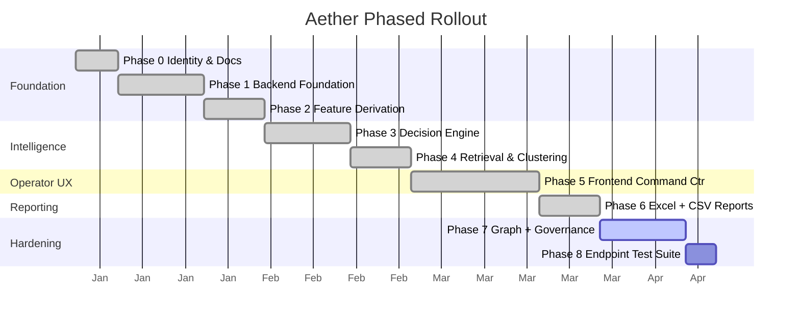

# Phased Roadmap

## Phase 0: Identity & Docs
- Project repositioned as Aether
- Architecture diagrams in Mermaid
- Decision engine concepts documented
- Portfolio positioning defined

## Phase 1: Backend Foundation
- FastAPI app scaffolded
- PostgreSQL models (11 tables)
- Alembic migrations
- Normalized Excel ingest
- Immutable ticket events on import

## Phase 2: Feature Derivation
- Thread cleaner and summary extraction
- Severity, urgency, business impact, SLA features
- Recurrence and actionability signals

## Phase 3: Decision Engine
- Priority scoring policy implemented
- Root cause rule engine
- Decision records persisted
- Ranked recommendations generated

## Phase 4: Retrieval & Clustering
- Similar-case indexing and lookup
- Duplicate detection heuristics
- Incident clustering logic and linkage

## Phase 5: Frontend Command Center
- Next.js app scaffolded
- Ranked queue and ticket case view
- Recommendation stack and confidence meter
- Incident detail and audit timeline
- Replay view and operator feedback

## Phase 6: Reporting
- 5-tab styled Excel workbook
- Charts, conditional formatting, risk bands
- Report export panel in UI

## Phase 7: Hardening
- Immutable audit snapshots
- WebSocket updates
- Decision determinism tests
- Split CI/CD pipelines (api, web, reports)

## Commit Sequence

1. docs: reposition project as Aether
2. docs: add mermaid architecture diagrams
3. docs: define decision engine concepts
4. backend: scaffold FastAPI app
5. db: add PostgreSQL models
6. db: add Alembic migrations
7. ingest: add normalized Excel loader
8. events: persist immutable ticket events
9. features: add thread cleaner
10. features: add scoring signals
11. features: add recurrence signals
12. decision: add priority scoring
13. decision: add root cause rules
14. decision: persist decision records
15. recommendations: add ranked generation
16. retrieval: add similar-case index
17. retrieval: add duplicate detection
18. incidents: add clustering logic
19. web: scaffold command center
20. web: add ranked queue view
21. web: add recommendations panel
22. web: add incident detail
23. web: add audit replay
24. reports: add styled Excel
25. reports: add charts and formatting
26. web: add report export panel
27. audit: add snapshots and replay
28. realtime: add WebSocket updates
29. tests: add decision coverage
30. ci: split pipelines

## Phase Timeline

