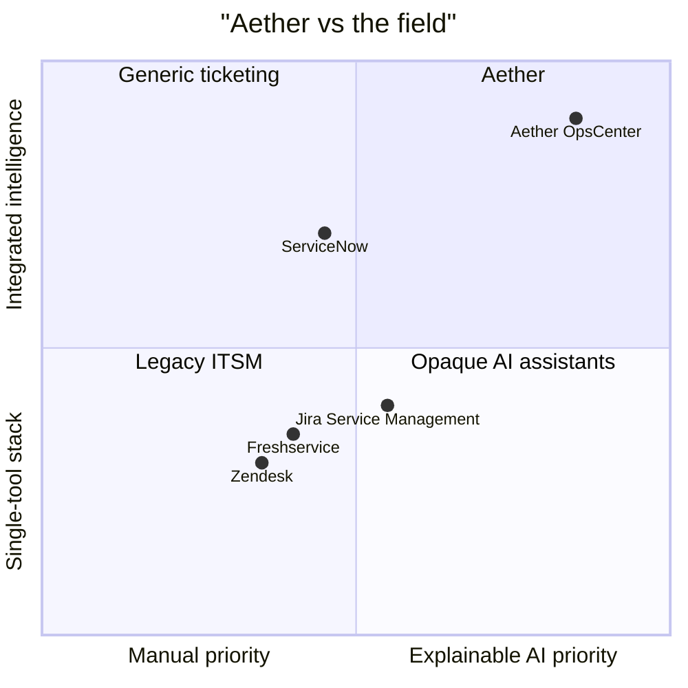

# Portfolio Positioning

## Product Elevator Pitch

> Aether is an operational incident intelligence platform that transforms raw service tickets into ranked, explainable, and auditable actions through event-sourced case history, business-impact-aware prioritization, similar-case retrieval, incident clustering, and operator feedback loops.

## Problem Statement

IT operations teams are drowning in ticket noise. Dashboards show what happened but not what to do first. Priority is based on gut feel or raw priority fields. Incidents span multiple tickets but are managed individually. There's no operational memory — the same problem repeats with no institutional learning.

## Solution

Aether provides:
- **Ranked decisions, not raw queues** — 7-factor priority scoring with explainable weights
- **Incident intelligence** — automatic clustering of related tickets with common-cause detection
- **Operational memory** — similar-case retrieval with resolution effectiveness tracking
- **Explainable AI** — every recommendation has a rationale traceable to prior outcomes
- **Audit replay** — immutable event stream with point-in-time reconstruction

## Competitive Differentiation

| Capability | Generic Ticketing | Jira Service Management | Aether |
|---|---|---|---|
| Priority scoring | Raw priority field | AI-assisted (opaque) | 7-factor weighted (explainable) |
| Incident grouping | Manual | Rule-based | Automatic clustering |
| Similar cases | Search | None | Retrieval with effectiveness |
| Audit trail | Basic | None | Full event replay |
| Recommendations | None | Generic | Category-specific runbooks |

## Target Users

- IT Operations managers
- Support team leads
- NOC analysts
- Incident coordinators

## Value Proposition

**Before Aether**: 400 open tickets, no clear ranking, same incidents reoccurring, no accountability for recommendations.

**After Aether**: Tickets ranked by operational impact, incidents automatically grouped, similar-case resolution path suggested, every recommendation logged and tracked.

## Positioning Quadrant

