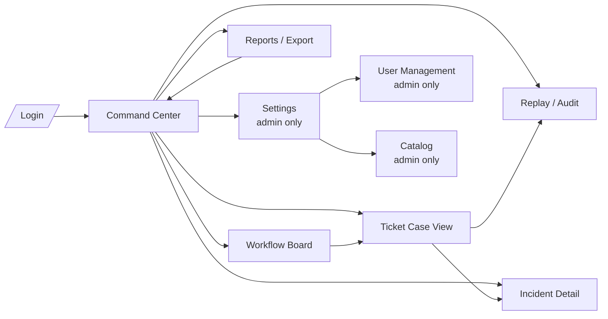

# Screen Map

## Screen 1: Command Center

**Purpose**: Primary operator surface — ranked work queue with decision context

**Layout Structure**:

| Left Panel | Center Panel | Right Panel |
|---|---|---|
| Ranked Queue | Selected Ticket Details | Recommendation Stack |
| Filters | Summary, Timeline, Metrics | Rank 1-3 with Accept/Reject |
| SLA Alerts | Linked Assets | Confidence Meter |
| Incidents | | Similar Cases, Quick Actions |

**Key Elements**:
- **Ranked Queue**: Tickets sorted by priority score (highest first)
- **Filters**: Status, priority, category, assignee, site
- **SLA Alerts**: Tickets approaching or breaching SLA
- **Incidents**: Clustered incident indicators
- **Selected Ticket**: Clean summary, timeline, score breakdown
- **Recommendation Stack**: 3-5 ranked actions with confidence scores
- **Confidence Meter**: Visual indicator of decision certainty

## Screen 2: Ticket Case View

**Purpose**: Deep-dive per ticket reasoning

Sections:
- Clean summary (thread-cleaned description)
- Original raw description
- Event timeline (immutable event stream)
- Score breakdown (7 sub-scores with bar charts)
- Root cause hypothesis (top matching class + confidence)
- Recommendations (3–5 ranked actions)
- Similar prior cases (top 5 with resolution effectiveness)
- Operator feedback panel

## Screen 3: Incident Detail View

**Purpose**: Coordinated handling of clustered tickets

Sections:
- Incident title + key
- Suspected common cause
- Related tickets (primary, related, duplicate, inferred)
- Affected sites/assets
- Business impact estimate
- Recommended coordinated action
- Cluster confidence score

## Screen 4: Replay / Audit View

**Purpose**: Point-in-time audit and decision explanation

Sections:
- Point-in-time snapshot selector (date/time slider)
- Decision record at selected time T
- Recommendation history over ticket lifetime
- Operator overrides (what changed and why)
- Final resolution outcome
- Version diff (rule set changes that affected this ticket)

## Screen 5: Reports / Export

**Purpose**: Executive and operational reporting

Sections:
- Report type selector (Executive / Operational / Incident / Decision / Audit)
- Date range filter
- Preview pane
- Export as Excel button
- Scheduled report configuration (future)

## Screen Navigation Graph

